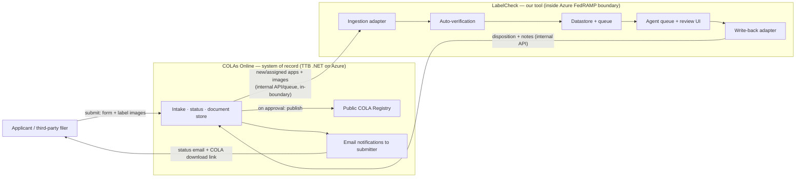
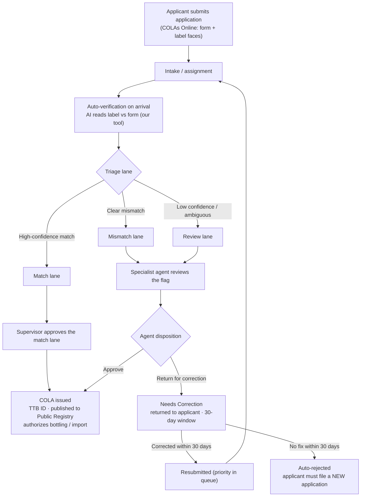
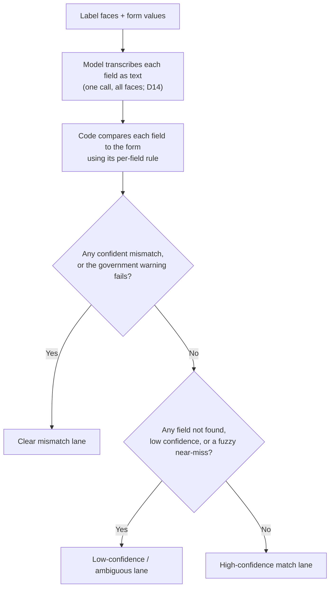
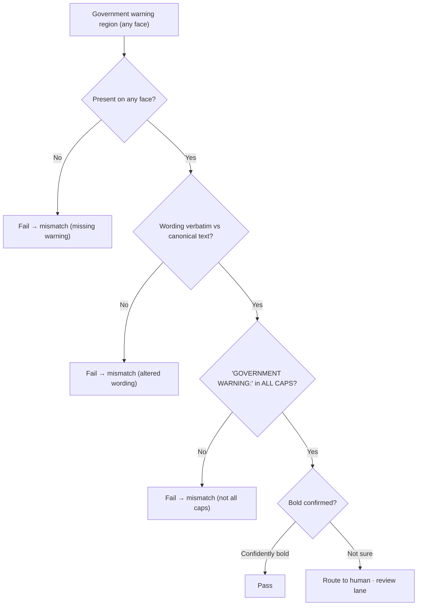
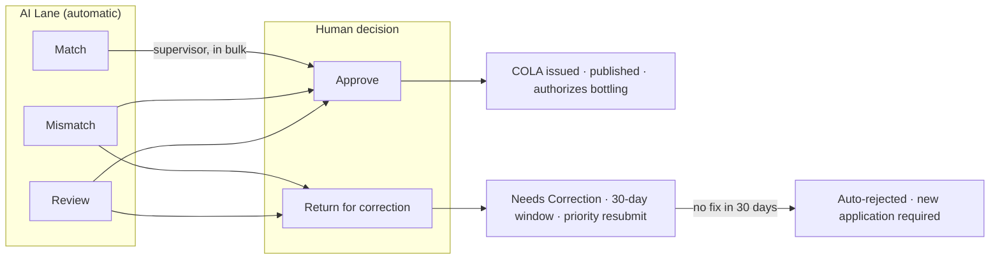

# Process Flowcharts and Business Rules

Status: draft for review
Owner: solo developer
Last updated: 2026-06-10

This document visualizes the business processes the tool sits inside: the real TTB COLA lifecycle, the AI verification and triage logic, the government-warning sub-check, and the rules that govern each decision. Diagrams are written in Mermaid; if your viewer does not render Mermaid, the rules are also stated in prose below each one.

One distinction runs through everything: a Lane is the AI's automatic triage call for the whole application (match, mismatch, review); a per-field Verdict is the comparison result on a single field (match, mismatch, not found, low confidence); and a Disposition is the agent's decision (approve, return for correction, reject), which carries legal weight. The tool assigns the lane; the human owns the disposition.

## System Context: Where Applications Come From and Where Decisions Go

The most important integration fact: COLAs Online is the system of record, and it already owns the entire applicant relationship, intake, status tracking, and all notifications. Our tool is a decision-support layer that sits beside it. Our tool does not talk to applicants and does not send email. It reads applications from COLAs Online and writes the agent's disposition back to COLAs Online, which then communicates with the applicant. Designing it any other way would duplicate the system of record and fragment the applicant's experience.

Inputs, the how and where. In production, applications originate from applicants (or their third-party filers) who submit through COLAs Online. Our tool ingests new and assigned applications, with their form data and label images, from COLAs Online through an internal integration that stays inside the agency's Azure FedRAMP boundary, not over the public internet and not by email. This in-boundary constraint is not optional: the agency firewall blocks external endpoints, which is what broke the prior vendor (assumption A21; systemsdesign Production Evolution Path; techstack Model Selection). The exact mechanism (an internal API, a message queue, or a database/event feed exposed by COLAs Online) is a production integration to be agreed with the COLA team; TTB does not publish it, and the prototype deliberately does not integrate at all (assumption A6). Label images come from the COLAs Online document store and are referenced, not copied, into our object storage (schema.md).

Outputs, the how and where. The agent's disposition (approve, return for correction, reject) is written back to COLAs Online through the write-back adapter. COLAs Online, as the system of record, then does the applicant-facing work that it already does today: it emails the submitter the status change (Approved, Needs Correction with the list of required corrections and the 30-day clock, or Rejected), and on approval it emails a link to download the approved COLA and publishes the COLA to the Public COLA Registry. Our tool sends nothing to applicants and publishes nothing itself; it produces the decision, and COLAs Online communicates it.

Prototype reality. The prototype is standalone and integrates with nothing (assumption A6). Applications come from manual entry or the bundled sample set plus a direct image upload; dispositions are recorded only within the session, nothing is submitted to COLAs Online, nothing is emailed, and nothing is persisted (NFR-4; constraints: Compliance). The diagram above is the production target the prototype is shaped to fit, with the ingestion and write-back adapters being the seams where the real COLA integration would later attach (systemsdesign: Production Evolution Path).

## 1. End-to-End COLA Lifecycle

Where our tool fits in the real TTB process, from submission to final outcome.

In prose: applications arrive through COLAs Online as structured form data plus uploaded label faces. Our tool verifies each one automatically at intake and assigns a lane. A supervisor approves the clean match lane in bulk. The mismatch and review lanes are distributed to specialist agents, who review and decide. The agent's disposition is one of two: Approve issues the COLA (used when the flag was a false positive, or once the issue is resolved), or Return for correction, which sends the application back to the applicant with a 30-day window, where a corrected resubmission jumps the queue. There is no manual reject: a Needs-Correction application that is not corrected within 30 days is auto-rejected, and the applicant must start over with a new application.

## 2. AI Verification and Triage Logic

How the tool turns a label and a form into one lane. The model only reads; the code decides (systemsdesign D4, D5).

The priority order matters: a confident mismatch or a warning failure always wins and routes to the mismatch lane, so a real problem is never hidden behind an otherwise-clean result. Only when nothing is a confident mismatch and nothing is uncertain does an application reach the match lane. Confidence here is code-derived (match margin plus the model's legibility flag), not the model's self-reported confidence.

## 3. Government-Warning Sub-Check

The highest-stakes field, checked across all faces (the warning usually sits on the back).

Presence, verbatim wording, and all-caps are verified strictly in code from the transcribed text. Bold is treated as best-effort: when it cannot be confirmed confidently, the result is routed to a human rather than auto-passing or auto-failing (systemsdesign D6).

## 4. Per-Field Matching Rules

The rule applied to each field during comparison.

| Field | Rule | Notes |
|---|---|---|
| Brand name | Fuzzy: case, punctuation, spacing tolerant | "STONE'S THROW" = "Stone's Throw" |
| Class / type | Fuzzy, same as brand | Designation may be more specific on the label |
| Alcohol content | Exact (normalized) for the prototype | Real TTB tolerances acknowledged, not implemented (A19) |
| Net contents | Normalized then exact | "750 mL" = "750ML" |
| Bottler / producer | Fuzzy (address formatting varies) | Default; configurable |
| Country of origin | Exact, only when required (imports) | |
| Government warning | Exact: presence + verbatim + all-caps; bold best-effort | See section 3 |

All thresholds and the canonical warning text live in configuration, not code, so a compliance reviewer can adjust them (FR-25).

## 5. Disposition Rules and Outcomes

What each agent decision means in the real process.

Rules:
- Approve issues the COLA, which carries a unique TTB ID, is published to the Public COLA Registry, and authorizes the applicant to bottle or import and sell with matching labels. It generally does not expire.
- Return for correction (Needs Correction) is the usual response to a genuine mismatch. The application returns to the applicant with the issues noted and a 30-day correction window. A corrected resubmission gets priority over new applications. If not corrected within 30 days, it auto-rejects.
- There is no manual reject. Rejection is automatic: a Needs-Correction application not corrected within its 30-day window is auto-rejected by the system, and the applicant must submit a brand-new application with no priority.
- Approve also handles a false positive: when the AI flags something that is actually fine (for example a brand near-miss that is clearly the same product), the agent approves it. The clean match lane is approved by a supervisor in bulk; specialist agents decide only on the mismatch and review lanes routed to them.

## 6. Cross-Cutting Rules

- Unit of work: the Application (one form plus one or more label faces). Volume figures count applications (systemsdesign D13).
- Multi-face: a field is satisfied if found on any face; the warning is checked across all faces (D12).
- Human accountability: the agent owns every disposition. High-confidence matches are bulk-confirmed by default; true auto-clear without a human glance is an agency policy dial, off by default (D11).
- Speed: verification targets under five seconds per application so agents actually use the tool (NFR-1).
- Prototype scope: the tool is a standalone verification assist. Intake comes from COLAs Online in production (simulated in the mockup; assumption A6).
- Routing: the tool owns work distribution over the triaged exceptions. The match lane is bulk-confirmed and never routed; the mismatch and review lanes enter one prioritized shared work pool that agents pull from (claiming an item assigns it), with supervisor hand-assign as an override. Routing therefore covers only the roughly 30 percent exception volume, not all applications. Routing is also specialization-aware: each exception is matched to an agent who specializes in that beverage type (wine, distilled spirits, or malt beverage), with overflow to any available agent to prevent backlog. The prototype is single-user, so routing is effectively simulated (systemsdesign D15).
- Data mapping: the lanes, statuses, and dispositions in these diagrams correspond to fields in the production data model, the AI lane to verification.lane and application.lane, the status to application.status (received, assigned, in_queue, needs_correction, approved, rejected), and the disposition to disposition.decision (approve, return_for_correction, auto_reject — the last is system-generated when the 30-day correction window lapses). An "override" is an approve disposition where the agent cleared something the tool flagged; it is captured in the disposition.note field and the audit_event log, not as a separate decision value. See schema.md. The prototype persists none of this (NFR-4; constraints: Compliance).

## Sources

TTB process details verified June 2026:
- [Certificate of Label Approval (COLA) — TTB](https://www.ttb.gov/alfd/certificate-of-label-aproval-cola)
- [eApplication Statuses in COLAs Online (TTB PDF)](https://www.ttb.gov/system/files/images/pdfs/labeling_colas-docs/eapplication-statuses-in-colas.pdf)
- [COLAs and Formulas Online FAQs — TTB](https://www.ttb.gov/faqs/colas-and-formulas-online-faqs) (email notifications of status changes to the submitter; approval emails a COLA download link)
- [TTB's COLAs Online Electronic Filing System — TTB](https://www.ttb.gov/alfd/colas-online-electronic-filing-system) (system of record; electronic notification of approval/rejection)
