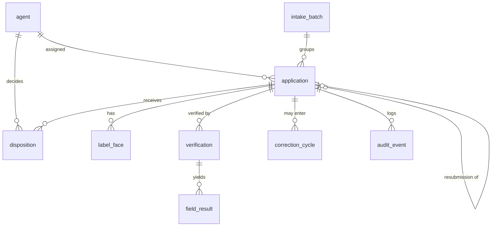

# Data Architecture and Schema

Status: draft for review
Owner: solo developer
Last updated: 2026-06-10

This document lays out the database architecture for the system and justifies it end to end, grounded in the core problem (verify that an alcohol label matches its application, at scale), requirements.md, and constraints.md.

## Scope: Prototype vs Production

A critical clarification up front. The prototype deliberately has no database. It persists nothing: images and form values are processed in memory, and batch state is ephemeral (constraints: Compliance; NFR-4; assumption A8, no-data-persistence). That was a deliberate choice because the prototype carries applicant PII and IT required that nothing sensitive be stored.

So this schema describes the production data architecture, the data model a real deployment would need to support the workflows and views we have already designed: the agent queue, the full application record and history, dispositions and the correction lifecycle, audit, analytics, and team performance. None of these features can exist statelessly. The moment the product needs to answer "what happened to application X last month" or "what is each agent's mismatch rate," it needs a datastore. The prototype omits all of this on purpose; production adds it.

The prototype's in-memory structures (the mockup's application and history arrays) are best understood as a denormalized read model: a flattened join of the tables below, held in memory for a demo. This document is what makes that real.

## Why the Requirements Demand a Datastore

Each persistent feature traces to a requirement or a process rule, and each implies tables:

- The full application record with status and history (the All Applications view) requires durable storage of every application and its lifecycle transitions.
- The three-lane review model and the field-by-field breakdown (FR-13, FR-14, FR-24) require storing each verification's per-field results, not just a final verdict.
- Dispositions and regulatory accountability (the human owns the decision; the agency carries legal liability) require an immutable record of who decided what and when. This is the single most important reason for a database.
- The Needs-Correction lifecycle with a 30-day window and resubmission priority (the real COLA process; flowchart.md) requires tracking correction cycles and links between an application and its resubmission.
- Analytics (volume, outcome rates, top mismatch reasons, throughput by agent) require queryable historical data and, at scale, rollups.
- Assignment, the team view, and production access control (NFR-8: PIV/CAC, roles, audit) require a user and role model and an audit log.
- Configurable, auditable rules, the canonical warning text and per-field tolerances (FR-25) require versioned configuration storage.

## Technology Choice

Primary store: a relational database, specifically PostgreSQL, hosted in production as a managed service inside the agency's Azure FedRAMP boundary (Azure Database for PostgreSQL). Justification:

- The data is highly relational. An application has many label faces, has verifications, which have many field results, has dispositions, has correction cycles. These are foreign-key relationships with referential integrity, which a relational engine enforces natively.
- The audit and disposition records need ACID transactions. A regulatory system cannot tolerate a disposition that half-committed. Relational transactions guarantee this; most NoSQL stores trade it away.
- Analytics needs joins and aggregations across applications, verifications, field results, and dispositions. SQL with proper indexes does this well; a document store would force application-side joins.
- PostgreSQL offers JSONB columns, which give schema flexibility exactly where it is needed (per-beverage-type form fields, the model's raw extraction) without abandoning the relational model for everything else. This resolves the only real argument for NoSQL here.
- It is mainstream and runs inside the FedRAMP boundary, which matters given the firewall and compliance constraints (assumption A21; systemsdesign: Production Evolution Path).

Secondary store: object storage (Azure Blob) for the label face images. Images are large binaries with their own retention and lifecycle rules, and do not belong in the relational database. The database stores a reference (a storage key and checksum), not the bytes. This keeps the database lean and lets image retention and encryption be governed separately.

Append-only audit: the audit log is write-once. In production it is enforced by granting the application no UPDATE or DELETE on that table (or by writing to an immutable store), so the trail cannot be altered.

Analytics performance: at 150,000 applications a year the base tables are modest, but dashboard queries over years of data benefit from rollup tables or materialized views refreshed on a schedule, rather than scanning raw rows on every dashboard load.

This matches the load profile in constraints.md: low write throughput (around 600 applications a day), bursty intake (a 300-application dump), and read-heavy dashboards. PostgreSQL handles this comfortably; no exotic scaling is needed.

## Entities

Each table below lists its key columns and the reason it exists. Types are indicative.

### agent

The users of the system, for assignment, the team view, and production access control.

| Column | Type | Notes |
|---|---|---|
| id | uuid PK | |
| full_name | text | |
| email | text unique | |
| role | enum | agent, admin (admin is the division supervisor; see CONTEXT.md and systemsdesign D16) |
| team | text | for the team view |
| auth_subject | text | PIV/CAC identity (production) |
| active | bool | account enabled |
| availability | enum | available, out_of_office — routing eligibility, distinct from active |
| specialization | enum set null | beverage types this agent handles (wine, distilled_spirits, malt_beverage); drives specialist routing |

Justification: assignment (work routing), the team performance view, and role-based access (NFR-8) all need a user model. The availability column governs pull-routing eligibility (systemsdesign D15): an out-of-office agent is not sent new exceptions and their claimed items can be reassigned. It is set from the agent's Profile and is distinct from active (which enables or disables the account). The specialization column lets an agent be a label specialist (for example wine only); the router matches each application's beverage_type to a specialist, so specialized teams handle only their types, with overflow to any available agent to prevent backlog. Admins assign it in the Team view. The role column drives the two shells in systemsdesign D16: Admin queries are global, Agent queries are row-scoped to the logged-in agent (own claimed items, own stats). No new tables are needed for the role split.

### application

The unit of work: one form plus its label faces (CONTEXT.md; systemsdesign D13). The spine of the schema.

| Column | Type | Notes |
|---|---|---|
| id | uuid PK | internal id |
| ttb_id | text unique | the public TTB identification number |
| applicant_name | text | PII |
| beverage_type | enum | wine, distilled_spirits, malt_beverage |
| source | enum | domestic, imported |
| brand_name | text | form value |
| fanciful_name | text null | |
| class_type | text | |
| alcohol_content | text | |
| net_contents | text | |
| producer_name | text | PII |
| producer_address | text | PII |
| country_of_origin | text null | required for imports |
| form_extra | jsonb | beverage-type-specific fields (appellation, vintage, etc.) |
| intake_batch_id | uuid FK null | groups peak-season submissions |
| assigned_agent_id | uuid FK null | set when an agent claims the exception from the shared pool (D15) |
| claimed_at | timestamptz null | when the item was pulled from the pool |
| status | enum | received, assigned, in_queue, needs_correction, approved, rejected |
| lane | enum null | match (high-confidence match), mismatch (clear mismatch), review (low-confidence or ambiguous). AI verdict; null until verified. See CONTEXT.md: Lane. |
| parent_application_id | uuid FK null | links a resubmission to the original |
| submitted_at | timestamptz | |
| verified_at | timestamptz null | |
| dispositioned_at | timestamptz null | |

Justification: supports the queue, the full record and history, status lifecycle (the COLA process), assignment, and the resubmission link. JSONB form_extra handles the per-beverage-type field variation (FR-3) without a column explosion.

### label_face

The one-or-more faces of an application (multi-face support; D12). Images live in object storage; this row holds the reference.

| Column | Type | Notes |
|---|---|---|
| id | uuid PK | |
| application_id | uuid FK | |
| face_type | enum | front, back, neck, other |
| image_uri | text | object-storage key, not the binary |
| content_type | text | |
| checksum | text | integrity |
| uploaded_at | timestamptz | |

Justification: multi-face applications, with the image bytes kept out of the database for retention and cost reasons.

### verification

One run of the AI verification for an application. Storing it lets results re-render without re-calling the model and provides an audit of what the model saw.

| Column | Type | Notes |
|---|---|---|
| id | uuid PK | |
| application_id | uuid FK | |
| model_name | text | e.g., claude-sonnet-4-6 |
| model_version | text | |
| lane | enum | computed verdict |
| overall_confidence | numeric | code-derived (D5) |
| latency_ms | int | feeds the 5-second monitoring (NFR-1) |
| raw_extraction | jsonb | the model's per-face transcription (text only; D4) |
| is_current | bool | latest run for the application |
| created_at | timestamptz | |

Justification: the three-lane model and confidence (FR-5, FR-13, D5), re-rendering without re-spend, latency monitoring, and an audit of the model's reading. Re-runs (after a better image) are new rows.

### field_result

The per-field verdict within a verification. This is what powers the field-by-field breakdown and the mismatch-reason analytics.

| Column | Type | Notes |
|---|---|---|
| id | uuid PK | |
| verification_id | uuid FK | |
| field_name | text | brand, alcohol_content, government_warning, etc. |
| form_value | text | |
| extracted_value | text | |
| source_face | enum null | which face it came from |
| verdict | enum | match, mismatch, not_found, low_confidence |
| confidence | numeric | code-derived |
| reason | text | short explanation |

Justification: FR-14 and FR-24 (the breakdown), and the top-mismatch-reasons analytic (group by field_name where verdict = mismatch).

### disposition

The agent's decision. Append-only. This is the audit-critical, legally weighty record.

| Column | Type | Notes |
|---|---|---|
| id | uuid PK | |
| application_id | uuid FK | |
| agent_id | uuid FK | who decided |
| decision | enum | approve, return_for_correction, auto_reject (system-generated, agent_id null) |
| return_reason | jsonb null | required when decision = return_for_correction. Structured summary derived from the latest verification's field_results: failed fields, system reads, form values, and an optional agent note. Drives the applicant-facing correction message (FR-26a). |
| note | text | rationale, especially for overrides |
| decided_at | timestamptz | |

Justification: the human owns the disposition and the agency is legally accountable (constraints: Review Model; flowchart.md). Append-only so the decision history cannot be rewritten.

### correction_cycle

Models the Needs-Correction lifecycle: the 30-day window, resubmission priority, and auto-rejection.

| Column | Type | Notes |
|---|---|---|
| id | uuid PK | |
| application_id | uuid FK | the returned application |
| returned_at | timestamptz | |
| due_at | timestamptz | returned_at + 30 days |
| reason | text | issues returned to the applicant |
| resubmitted_application_id | uuid FK null | the resubmission, if any |
| state | enum | pending, resubmitted, auto_rejected |

Justification: the real COLA process (flowchart.md). The due_at drives the auto-reject job; the resubmission link supports queue priority.

### intake_batch

Groups applications submitted together, for the peak-season dump and batch progress.

| Column | Type | Notes |
|---|---|---|
| id | uuid PK | |
| submitted_by | text | importer or applicant |
| channel | text | COLAs Online, etc. |
| count | int | |
| status | enum | processing, complete |
| created_at | timestamptz | |

Justification: FR-17 and FR-18 (batch intake and progress).

### rule_config

Versioned configuration: the canonical warning text, per-field tolerances, and per-type required fields. Versioned so every change is auditable.

| Column | Type | Notes |
|---|---|---|
| id | uuid PK | |
| config_type | enum | warning_text, field_tolerance, required_fields |
| beverage_type | enum null | null means all |
| jurisdiction | text null | |
| payload | jsonb | the actual text or thresholds |
| version | int | |
| effective_from | timestamptz | |
| effective_to | timestamptz null | |
| created_by | uuid FK | |

Justification: FR-25 (config-driven rules a compliance reviewer can inspect and adjust) and the auditability of rule changes. Versioning means a past verification can be interpreted against the rules in force at the time.

### audit_event

Append-only log of every meaningful action. The backbone of regulatory traceability.

| Column | Type | Notes |
|---|---|---|
| id | uuid PK | |
| at | timestamptz | |
| actor_type | enum | agent, system |
| actor_agent_id | uuid FK null | null for system actions |
| application_id | uuid FK null | |
| event_type | enum | intake, assigned, verified, viewed, disposition, override, image_requested, auto_rejected, config_changed |
| detail | jsonb | event-specific payload |

Justification: production audit logging (NFR-8). Immutable. Captures the full chain from intake to final disposition without holding the sensitive payloads themselves.

### metric_rollup

Pre-aggregated daily metrics for dashboards, so analytics does not scan raw rows on every load.

| Column | Type | Notes |
|---|---|---|
| day | date | |
| agent_id | uuid FK null | null means division-wide |
| processed | int | |
| match_ct / mismatch_ct / review_ct | int | lane counts |
| approved_ct / returned_ct / rejected_ct | int | disposition counts |
| avg_latency_ms | int | |
| avg_handling_seconds | int | |

Justification: the analytics dashboard (volume trend, outcome rates, throughput by agent) over years of data. Refreshed on a schedule from the base tables, or implemented as materialized views.

### knowledge_base

The content the chat assistant is grounded in: help articles, onboarding steps, best-practice notes, and plain explanations of the rules. The assistant retrieves from this rather than answering from the model's general knowledge (observability.md treats groundedness as the primary quality bar).

| Column | Type | Notes |
|---|---|---|
| id | uuid PK | one row per chunk |
| topic | text | e.g. government_warning, dispositions, onboarding |
| title | text | |
| body | text | the chunk's content |
| source_filename | text | the uploaded document this chunk came from |
| uploaded_by | uuid FK null | the admin who uploaded it |
| status | enum | indexed, processing, failed |
| embedding | vector null | for semantic retrieval (pgvector), production |
| version | int | versioned like rule_config |
| effective_from | timestamptz | |

Justification: a read-only assistant that must not invent compliance rules needs an authoritative, versioned source to retrieve from (FR-30). Admins populate it from the Knowledge Base tab by uploading documents (PDF, DOCX, Markdown, TXT), which are chunked, embedded, and indexed into rows that share a source_filename; status tracks the ingest. This is the only new application-side data the assistant requires; for summaries it reads existing tables (metric_rollup, scoped to the user's role) and adds nothing.

### What the assistant does not add to this schema

The assistant's conversation traces, per-turn prompts and responses, and thumbs-up/down feedback are observability data. They live in the self-hosted observability backend (Langfuse or Phoenix) defined in observability.md, not in this relational schema, which stays the system of record for applications and decisions. Keeping operational telemetry out of the application database is deliberate. If a regulator later requires that assistant interactions be retained as records, they would be logged to audit_event (event_type assistant_query) rather than given their own transactional tables.

## Entity Relationships

## End-to-End Data Flow

1. Intake. An application arrives (from COLAs Online in production; an intake_batch groups a peak-season dump). One application row plus its label_face references are written; an audit_event (intake) is logged.
2. Verification. The tool verifies the application automatically. One verification row and its field_result rows are written, lane and overall_confidence are set on the verification and mirrored to the application, and an audit_event (verified) is logged. Images are read from object storage, never persisted into the database.
3. Routing and review. Only the exception lanes are routed. The match lane is bulk-confirmed and not individually assigned. Mismatch and review applications form a shared, prioritized work pool (status in_queue, assigned_agent_id null). An agent pulls the next item, which claims it (sets assigned_agent_id and claimed_at) and logs an audit_event (assigned). Opening it logs an audit_event (viewed) and reads its current verification and field_results. A supervisor may hand-assign or reassign (D15).
4. Disposition. The agent decides. A disposition row is written (append-only), the application status is updated (approved, needs_correction, or rejected), and an audit_event (disposition or override) is logged.
5. Correction loop. A return-for-correction writes a correction_cycle with due_at = now + 30 days. A scheduled job auto-rejects cycles past due_at (writing the disposition equivalent and an audit_event). A resubmission creates a new application linked via parent_application_id, and is prioritized in the queue.
6. Analytics. A scheduled job refreshes metric_rollup from the base tables; dashboards read the rollups.

## PII, Retention, and Security

- PII columns are applicant_name, producer_name, and producer_address, plus the label images. These are governed in production by encryption at rest (Azure TDE), role-based access, and the audit log. The prototype holds none of this durably (NFR-4; assumption A8).
- A nuance specific to this domain: once a COLA is approved it becomes public record on the Public COLA Registry, so approved label and brand data is not secret. But applicant contact details, internal review notes, agent dispositions, and raw model extractions are internal and sensitive, and are protected accordingly. The schema does not assume everything is either fully public or fully private.
- Retention follows the applicable federal records schedule rather than being deleted ad hoc. Image lifecycle rules live in object storage.
- The audit_event and disposition tables are append-only to preserve an unalterable record, which is the property a regulatory system most needs.

## Indexing for the Load Profile

Given low write volume, bursty intake, and read-heavy dashboards (constraints: Scale and Load Profile):

- application: unique index on ttb_id; composite indexes on (assigned_agent_id, status) for the queue, on (status, submitted_at) for history filters, and on (lane) for triage filters.
- field_result: index on (verification_id) and on (field_name, verdict) for mismatch-reason analytics.
- verification: index on (application_id, is_current).
- audit_event and application: partition by month on the timestamp if volume grows, so old data does not slow current queries. At 150,000 rows a year this is a future optimization, not a launch need.

## Prototype-to-Production Mapping

To keep the two coherent: the prototype's in-memory application objects correspond to a join of application, its current verification, and its field_results; the prototype's history list corresponds to application plus its latest disposition; the prototype's team and analytics numbers correspond to metric_rollup. The prototype computes these on the fly from fixed sample data and keeps only ephemeral batch state in memory. Production replaces that ephemerality with the tables above, behind the same module boundaries the systems design already isolates (the job-store and persistence seams in systemsdesign.md), so adding the database does not disturb the extraction, matching, or triage logic.

## Open Questions

- Whether agent review notes and applicant correspondence need their own tables or belong in audit_event detail.
- Whether multiple jurisdictions (state-level requirements) are in scope, which would expand rule_config and possibly application.
- The exact federal records retention schedule that applies, which sets retention windows and deletion rules.
